### ユーザー

- 運営
- 選手
- 一般人

### ユーザーストーリー

- 選手または運営が、アカウント情報を登録する。
- 運営が、カスタムの結果を入力して選手のステータスを蓄積する。
- ユーザーが、選手の一覧を取得する。
- 運営が、選手一覧を入力してマッチングを計算し、結果を取得する。
- 運営が、マッチングを入力してDiscordのVCに選手を割り振る。

### ドメイン

- UserAccount
    - 認証・ロール情報
    - 下記ロールを想定
        - Admin(運営)
        - Player(選手)
        - General(一般人)
- PlayerStatus
    - 選手のステータス(ポイント、内部レートなど)を管理するドメイン
- MatchingSystem
    - 選手のステータスをもとにマッチングを計算するドメイン
- Robby
    - ロビーの状態を担保するドメイン
    - 現時点での実装はDiscordのVC

## システムの概要

